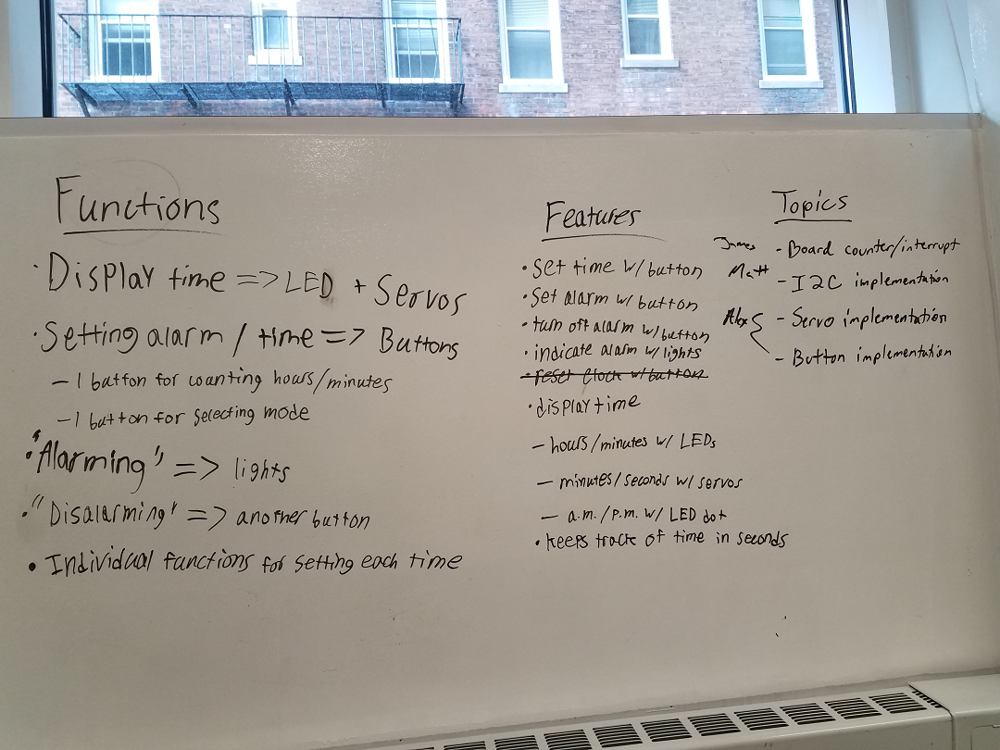
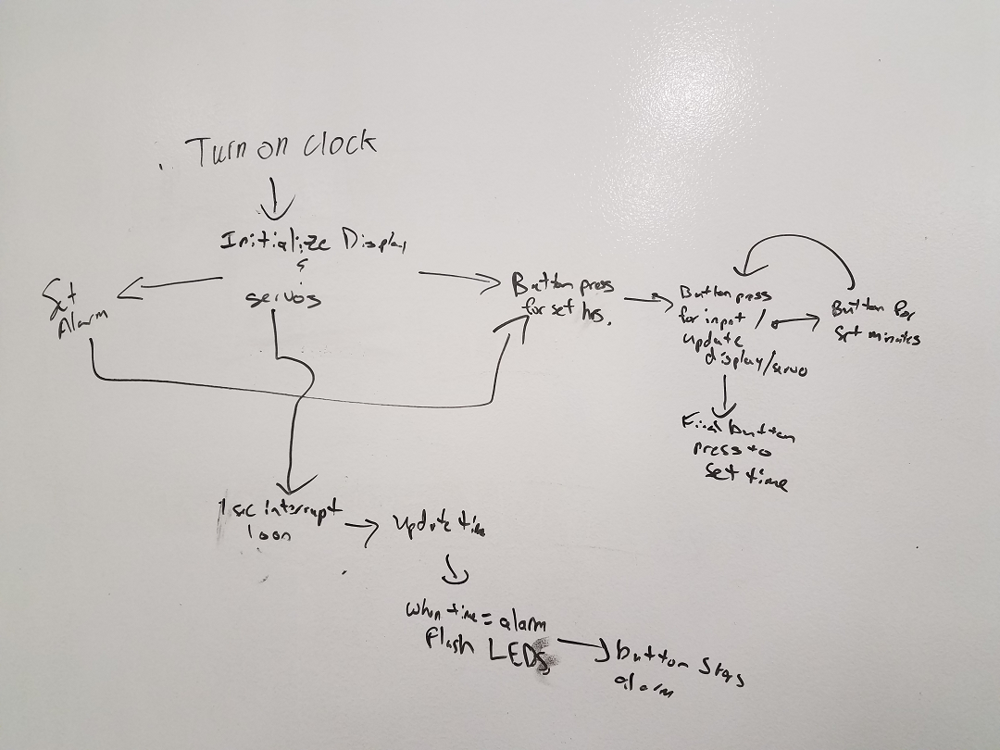
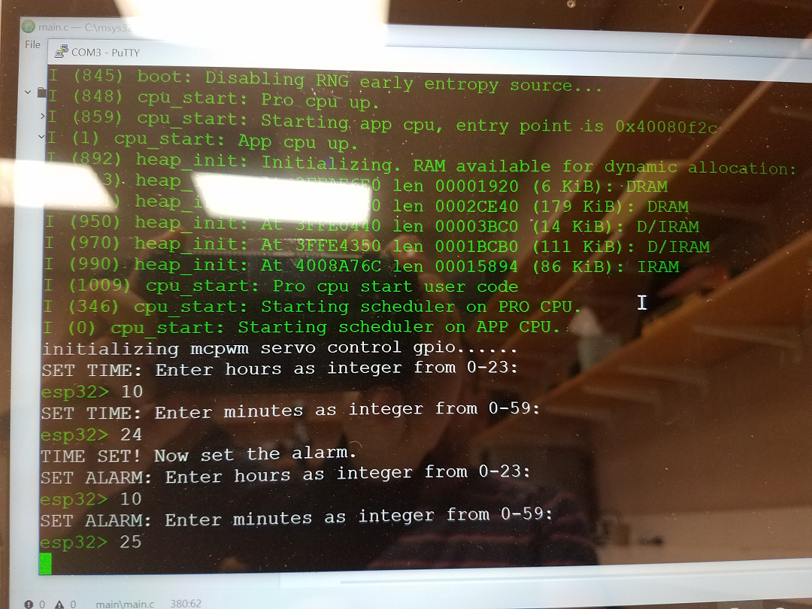
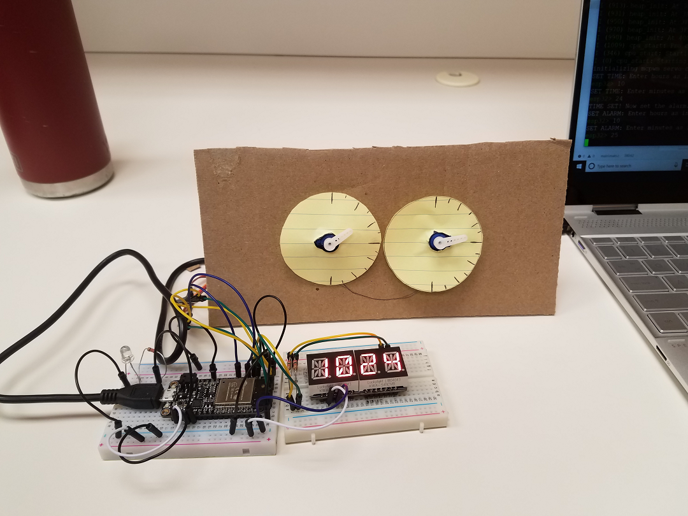
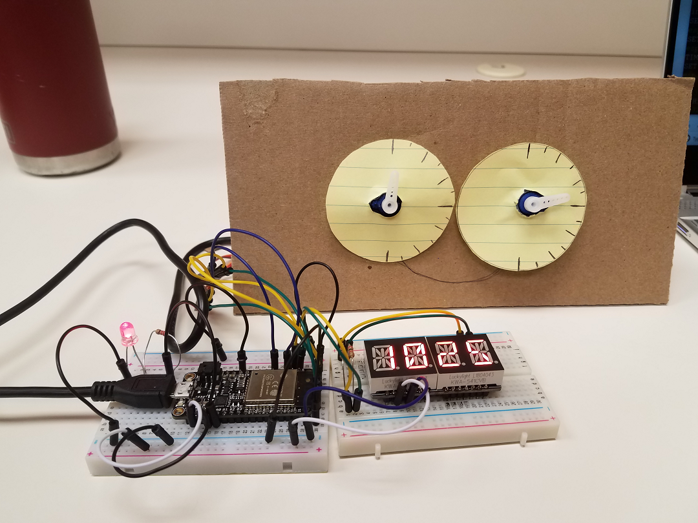

# Pseudo - Mechanical Alarm Clock
Authors: James Coll, Matt Boyd, Alex Trinh, 2018-09-23

## Summary

In this quest, we designed a pseudo-mechanical alarm clock that displays an inputted time with an LCD and passing time with servo motors. An alarm is indicated by lighting an LED.       

## Evaluation Criteria

We established the following specifications to evaluate our alarm's performance:

- Input time and alarm settings in the console
- Turn on an LED when the alarm time is reached 
- Silence the alarm from the console
- Display 12 hour clock on alpha display, without leading 0 for hours, with far left-hand decimal point lit to indicate "PM"
- Minute hand will sweep in 3 degree increments from 0 (top) to 180 (bottom) degrees, then immediately sweep back to 0 degrees at the top of the next hour
- Second hand will sweep 3 degrees per second from 0 (top) to 180 (bottom) degrees, then immediately sweep back to 0 degrees after one minute

## Solution Design

In  our main function, the timer is intialized and we ask the user to input the current time and an alarm time. After the input, the time is displayed, the servos begin rotating, and another loop is entered to continually update our global time variable. We have two time variables: a global variable called "time_seconds" and a volatile variable called "timer_seconds". The variable "time_seconds" is used to adjust the position of our servos as well as update the hours and minutes of the LCD display. To ensure "time_seconds" is always accurate, an interrupt happens every second to update the variable "timer_seconds". In the event that program hangs in a process, our main loop updates "time_seconds" with "timer_seconds" if the variables differ.

## Sketches and Photos

Preliminary sketches:

Setting clock time and alarm time:

Final setup running and waiting for alarm:

Alarm is indicated with red LED:

## Modules, Tools, Source Used in Solution

Timer Interrupt:

https://github.com/espressif/esp-idf/tree/17ac4bad7381e579e5a7775755cc25480da47d97/examples/peripherals/timer_group

i2c and Quadalpha Code from Adafruit:

https://github.com/adafruit/Adafruit_LED_Backpack/blob/master/Adafruit_LEDBackpack.cpp

Servo Control:

https://docs.espressif.com/projects/esp-idf/en/latest/api-reference/peripherals/mcpwm.html

https://github.com/espressif/esp-idf/tree/master/examples/peripherals/mcpwm/mcpwm_servo_control

