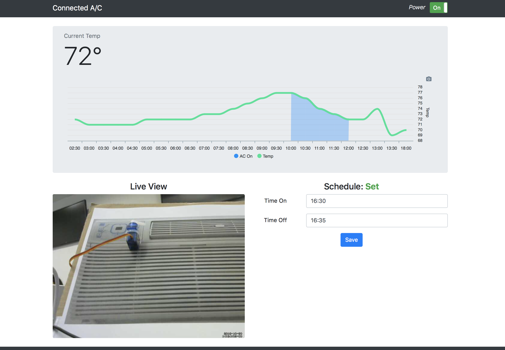

  ### Online Appliance
  
  Authors: James Coll, Matt Boyd, Alex Trinh, 2018-10-28
  
  ## Summary
  
  In this quest, we are able to remotely control a through-wall air conditioner by communicating through a local network to a 
  remote network. The local network consists of a web client and internet access. The remote network consists of a 
  router connected with an ESP32 and a Raspberry Pi, servo, thermistor, webcam, and the air conditioner (though it's not networked, of course).
  
  ## Evaluation Criteria
  
  The following specifications were required in our solution:
  - Sending data across separate IP networks 
  - Remotely controlling an actuator through web client
  - Receiving data from a remote sensor into web client 
  - Integrating Rpi webcam into web client
  - Incorporating time and appliance scheduling through web client
  
  ## Solution Design
  
  Our solution uses NodeJS running on the Raspberry Pi ("RPi") to poll the remote temperature of a thermistor attached to the ESP32 via a GET request (from the RPi to the ESP) every 30 minutes. This 
  data is then saved into a SQLite database on the RPi. An Express webserver is running under NodeJS on the RPi to display these temperature readings as a graph on a web page. The user can view the polled 
  temperature over a running 12 hour period. A different GET request (again from the RPi to the ESP), triggers the servo attached to the ESP to swing left-to-right (or right-to-left) to swipe the A/C's power button - turning the AC unit on or off. A webcam attached to the RPi allows the remote user to see the status of the air conditioner through the same web page. The web page allows the user to schedule the A/C to turn on or off at set times. The schedule is saved in the SQLite database and a schedule is set in NodeJS to send the command to the ESP's servo at the selected times. If the A/C is already on or off at the scheduled times, the job will see this and not run. Finally, the user is able to turn the A/C on or off at any time using a control on the web page. The web page is accessible from any location using DynDNS and port forwarding on the router. By connecting to ec444group11.ddns.net:8082, the web page can be accessed instead of using the ip address.
  
  ## Sketches and Photos
  
  Preliminary Sketch:
  
  
  
  Setup and Wiring:
  
  
  
  Webpage Display:
  
  
  
  ## Modules, Tools, Sources Used in Solution
   
  ADC Documentation: 
  https://docs.espressif.com/projects/esp-idf/en/latest/api-reference/peripherals/adc.html
  
  ADC1 Example: 
  https://github.com/espressif/esp-idf/tree/master/examples/peripherals/adc
  
  ADC2 Example: 
  https://github.com/espressif/esp-idf/tree/master/examples/peripherals/adc2
  
  Thermistor Datasheet: 
  http://www.eaa.net.au/PDF/Hitech/MF52type.pdf
  
  Thermistor to Temperature Conversion: 
  https://learn.adafruit.com/thermistor/using-a-thermistor
  
  Dynamic DNS Provider: 
  https://www.noip.com
  
  Bootstrap Toggle 
http://www.bootstraptoggle.com/

ApexCharts 
https://apexcharts.com/

Bootstrap 4 
https://getbootstrap.com/docs/4.0

Start Bootstrap: Heroic Features Template 
https://startbootstrap.com/template-overviews/heroic-features/

How do you extract POST data in Node.js? 
https://fullstack-developer.academy/how-do-you-extract-post-data-in-node-js/

Disk Space, Memory Use, and CPU Load: du, df, free, and w 
https://learn.adafruit.com/an-illustrated-shell-command-primer/checking-file-space-usage-du-and-df

NODE.JS WEBPAGE PART 2 
https://www.instructables.com/id/Nodejs-Webpage-Part-2/

Consume Remote API Data From Within A Node.js Application 
https://www.thepolyglotdeveloper.com/2017/10/consume-remote-api-data-nodejs-application/

I am sending a sqlite3 query result through node js to the browser as json 
https://stackoverflow.com/questions/50411135/i-am-sending-a-sqlite3-query-result-through-node-js-to-the-browser-as-json

Can't install node-sqlite3 on Raspberry pi 3 running raspbian 
https://github.com/mapbox/node-sqlite3/issues/933

DB Browser for SQLite 
https://sqlitebrowser.org/

ExpressJS Database integration: SQLite 
https://expressjs.com/en/guide/database-integration.html#sqlite

Git Pull While Ignoring Local Changes? 
https://stackoverflow.com/questions/4157189/git-pull-while-ignoring-local-changes

Updating Data in SQLite Database from a Node.js Application 
http://www.sqlitetutorial.net/sqlite-nodejs/update/

SQLite Strftime() Function 
https://www.tutlane.com/tutorial/sqlite/sqlite-strftime-function

SETTING WIFI UP VIA THE COMMAND LINE 
https://www.raspberrypi.org/documentation/configuration/wireless/wireless-cli.md

Pi 3 cannot connect to Enterprise WiFi using GUI 
https://raspberrypi.stackexchange.com/questions/58014/pi-3-cannot-connect-to-enterprise-wifi-using-gui

My simply Raspberry Pi Cheatsheet 
https://gist.github.com/hofmannsven/9132419

Install Node.js On A Raspberry Pi Zero W Without NodeSource 
https://www.thepolyglotdeveloper.com/2018/03/install-nodejs-raspberry-pi-zero-w-nodesource/

Build a Raspberry Pi Webcam Server in Minutes 
https://pimylifeup.com/raspberry-pi-webcam-server/

How to Run a NodeJS Web Server on a Raspberry Pi for Development 
https://blog.cloudboost.io/how-to-run-a-nodejs-web-server-on-a-raspberry-pi-for-development-3ef9ac0fc02c
 - follow this, but: 
   1. Clone "https://github.com/theonlymikeever/quick-react" into desired folder 
   2. Before "npm run start:dev", run npm install in folder created immediately above 

How do I set DNS Servers on Raspberry Pi? 
https://superuser.com/questions/617796/how-do-i-set-dns-servers-on-raspberry-pi

Simplified HTTP request client. 
https://github.com/request/request

The Node.js Request Module 
https://stackabuse.com/the-node-js-request-module/

Create a Scheduled Job on Startup With Express 
https://stackoverflow.com/questions/39248050/create-a-scheduled-job-on-startup-with-express

Cancel node-schedule event after it has been set 
https://stackoverflow.com/questions/33113287/cancel-node-schedule-event-after-it-has-been-set

A cron-like and not-cron-like job scheduler for Node. 
https://github.com/node-schedule/node-schedule

Inserting Data Into an SQLite Table from a Node.js Application 
http://www.sqlitetutorial.net/sqlite-nodejs/insert/

HTTPD Server Example  
https://github.com/espressif/esp-idf/tree/master/examples/protocols/http_server/simple
  
