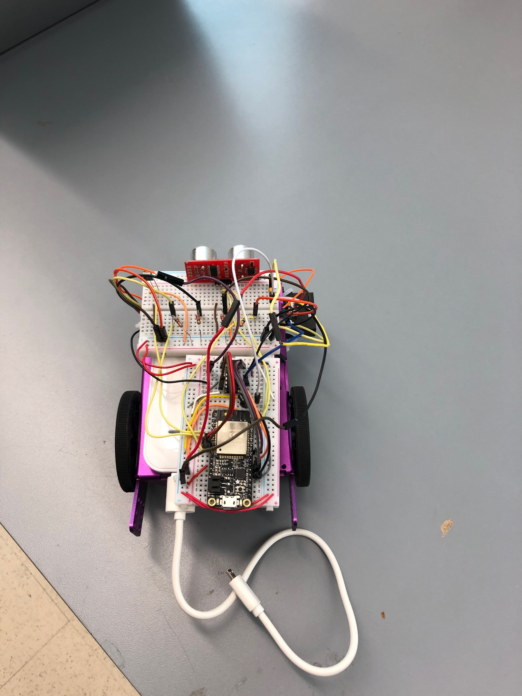
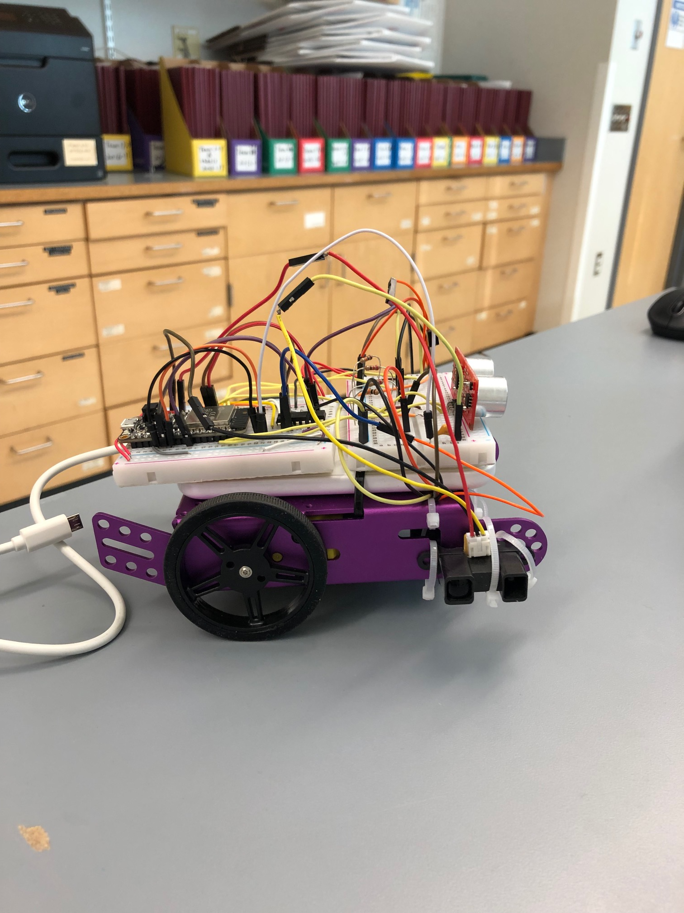
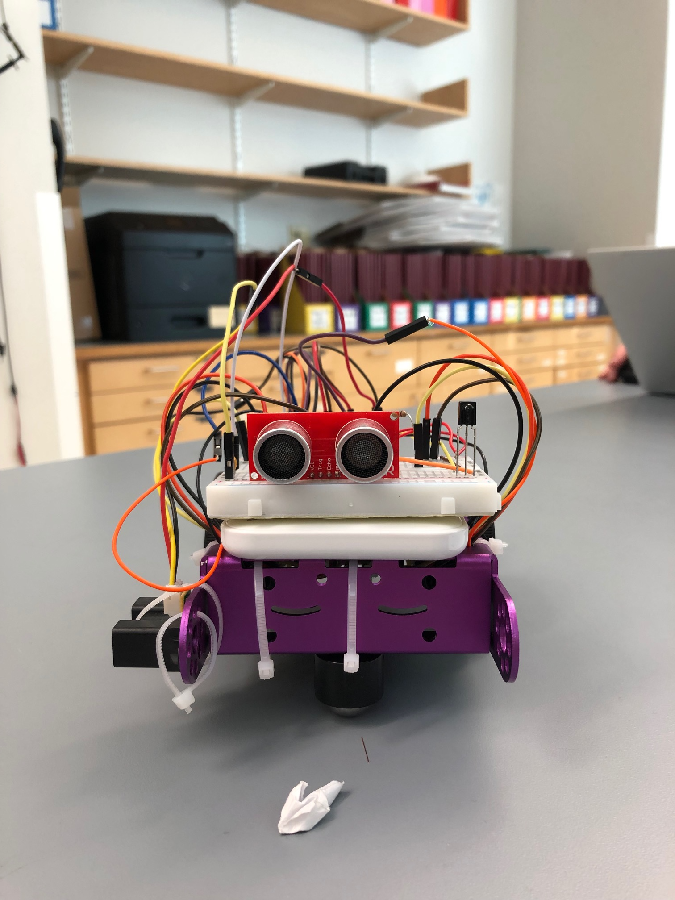

# Navigating a Car

Authors: James Coll, Matt Boyd, Alex Trinh

## Summary

We are able to have our car autonomously traverse a course using sensors for crash-avoidance and beacons for navigation. The car is equipped with an ultrasonic sensor in the front and an IR Range Sensor on the side to detect the proximity of the car from a wall. The car will then automatically adjust its wheel speed to remain straight along the course. Our car is also equipped with an IR receiver to detect the IR beacons to help navigate through the course. 

## Evaluation Criteria

The following specifications were required in our solution:
  - Execute turns
  - Traverse line segments 
  - Traverse full course successfully
  - Use beacons for navigation 
  - Integrate wheel speed 
  - Utilize PID controller

## Solution Design

Our solution was broken into the five following states:
- Idle
- Drive
- Turn
- Wait
- Adjust

The first 3 states are self-explanatory. The car will remain idle unless turned on, it will drive forward when there is no obstruction, and it will turn when it reaches a wall. The "wait" state stops the car for 2 seconds when a random obstruction appears and then transitions to "turn". Finally, the "adjust" state varies the wheel speeds in order to keep the car straight in case it drives too close or too far from the wall. 

When the car is turning, it will stay in the "turn" state for 1.6 seconds. Previous efforts with turning the car as a function of the wheel speed sensors and the distance sensors proved ineffective because of sensor innaccuracy. 

A webpage with an ON/OFF button is used to transition the car to and from the idle state. A GET request is used to pull the
sensor values in comma seperated format, and then display it on the webpage for real-time monitoring.

## Sketches and Photos

Preliminary Sketches:

Car Setup:

## Modules, Tools, Sources Used in Solution

Dynamic DNS Provider:  
https://www.noip.com

Ultrasonic Sensor Example Code:  
https://github.com/UncleRus/esp-idf-lib

Ultrasonic Sensor Data Sheet:  
https://cdn.sparkfun.com/assets/b/3/0/b/a/DGCH-RED_datasheet.pdf

IR Range Sensor Data Sheet:  
https://www.sparkfun.com/datasheets/Sensors/Infrared/gp2y0a02yk_e.pdf

LIDAR Data Sheet:  
https://cdn.sparkfun.com/assets/5/e/4/7/b/benewake-tfmini-datasheet.pdf

Graphing/Equation Calculator:  
https://mycurvefit.com/

HTTPD:  
https://github.com/espressif/esp-idf/tree/master/examples/protocols/http_server/simple

## Artifacts
Solution Code: https://github.com/BU-EC444/Quest4-Team11-Trinh-Boyd-Coll/tree/master/Code

Car Test: https://drive.google.com/open?id=1UDCC2WkLDl5Q6bOggCb6QhSOMkTMdynD

