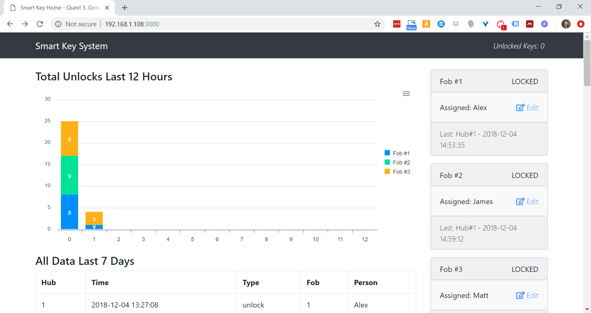

# Smart Key

Authors: James Coll, Matt Boyd, Alex Trinh

## Summary

We successfully designed smart key fobs that transmit unique IDs to a hub which logs an individual's presence in a database on
a Rasperry Pi. The RPi sends a confirmation to the fob that the system was successfully locked or unlocked, respectively turning off or lighting a green LED on the fob.

## Evaluation Criteria

The following specifications were required in our solution:
- Database logs each key-open request including time stamp, fob ID, hub ID, name of person with key
- Queries to database will reveal time series for key ID and presence (indicates if a devices has ‘checked-in’ to a room)
- Button press received at hub is passed to Pi where it is validated. Pi contacts the fob by WiFi and then fob turns on green light to indicate that key is unlocked

 

## Solution Design

Our solution consists of three fobs, each with a unique ID, and one hub. Each fob includes a button (which initiates an interrupt in the ESP code) that is pressed to initiate the unlock and lock sequences (i.e., sending IR data to the hub), otherwise the fob is not processing any activity. The hub recieves the ID and PIN Code (7568) encoded in the IR data from a fob and uses a GET request to transmit the ID and PIN Code to the RPi. When the hub receives IR data from a fob it lights its own blue LED to indicate data has been seen and is being sent to the RPi for processing; once the RPi informs the hub that the data has been processed successfully (and the fob locked or unlocked), the hub's blue LED is turned off. The RPi verifies the PIN Code is valid for the hub and if so, logs the Fob_ID, Hub_ID, and time in a relational database and subsequently initiates a GET request to the fob to indicate if the request was a lock or unlock (and altering the fob's green LED accordingly). We also attached a webcam to the RPi to show in real-time on the main web app page who is standing in front of the hub to unlock it. 

Relational database used on the RPi is SQLite3 and the design includes 3 tables:
  - Entry: Entry_ID, Fob_ID, Timestamp, Image, Status (lock vs unlock), Hub_ID
  - Fob: Fob_ID, Person_Name, IP_Address, Status (lock vs unlock)
  - Hub: Hub_ID, Hub_Name, Location

We designed a webpage to display data stored in the RPi. The interface graphs the total amount of unlocks per fob over 
the previous 12 hours, all lock and unlock activity over the previous 7 days, and additionally displays the following data:

 Fob:
  - Fob ID
  - Person name
  - IP Address
  - Status (locked or unlocked)
  
 Hub:
  - Hub Name
  - Location
  - Hub ID

 Security	vulnerabilities	of	design:
  - Easy impersonation of the Fob (by reading the IR data it transmits)
  - All data sent in clear text (both IR TX and Wifi GET requests)
  - Anyone can edit the Hub and Fob information on the web app (web client)
  - Not capturing who is in front of the RPi's webcam at each lock/unlock event for auditing

 Proposed	security mitigations:
  - Hash the PIN Code and Fob ID with a time-based value on the Fob and Un-hash on the RPi to verify data is coming from a valid Fob
  - Use SSL/TLS on Fob, Hub, and RPi to encrypt all Wifi data
  - Add user authentication to the web app 
  - Update Node/web app code to capture web cam images at each successful lock/unlock event and display in data table

 

## Sketches and Photos

Preliminary Sketches:

Fob Wiring:

Hub Wiring:

Webpage:

## Modules, Tools, Sources Used in Solution

HTTPD:  
https://github.com/espressif/esp-idf/tree/master/examples/protocols/http_server/simple

IR TX Setup:  
http://whizzer.bu.edu/individual-assignments/3-sensor-actuator/ir-escape-room

IR Beacon Example Code:  
https://github.com/BU-EC444/ec444-repo/tree/master/ir-car-beacon

IR Beacon Wiring:  
http://whizzer.bu.edu/team-quests/primary/car-track

SQL Query Strings with Node.js 
http://joecreager.com/sql-query-strings-with-node-js/

Add scripts in express-handlebars from view 
https://stackoverflow.com/questions/40386257/add-scripts-in-express-handlebars-from-view

How to generate timestamp unix epoch format nodejs? 
https://stackoverflow.com/questions/25250551/how-to-generate-timestamp-unix-epoch-format-nodejs

Convert array of objects into HTML table with jQuery or Javascript 
https://stackoverflow.com/questions/44127872/convert-array-of-objects-into-html-table-with-jquery-or-javascript

SQL As Understood By SQLite: Date And Time Functions 
https://www.sqlite.org/lang_datefunc.html

URL Parameters and Routing in Express.js 
https://webapplog.com/url-parameters-and-routing-in-express-js/

Concatenate Numbers in sqlite as text with a dash character 
https://stackoverflow.com/questions/31525924/concatenate-numbers-in-sqlite-as-text-with-a-dash-character

## Artifacts
Solution Code: https://github.com/BU-EC444/Quest5-Team11-Trinh-Boyd-Coll/blob/master/Code/README.md

Video Demonstration: https://www.dropbox.com/s/o36opv1ii4a1ebq/q5video.mp4?dl=0

