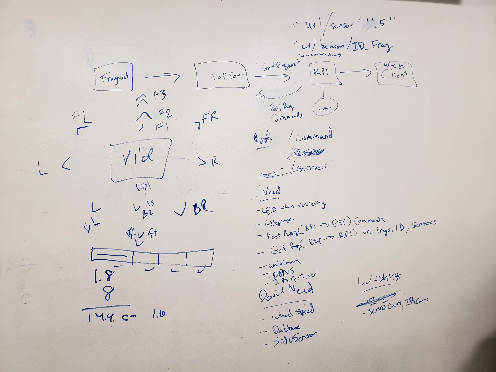
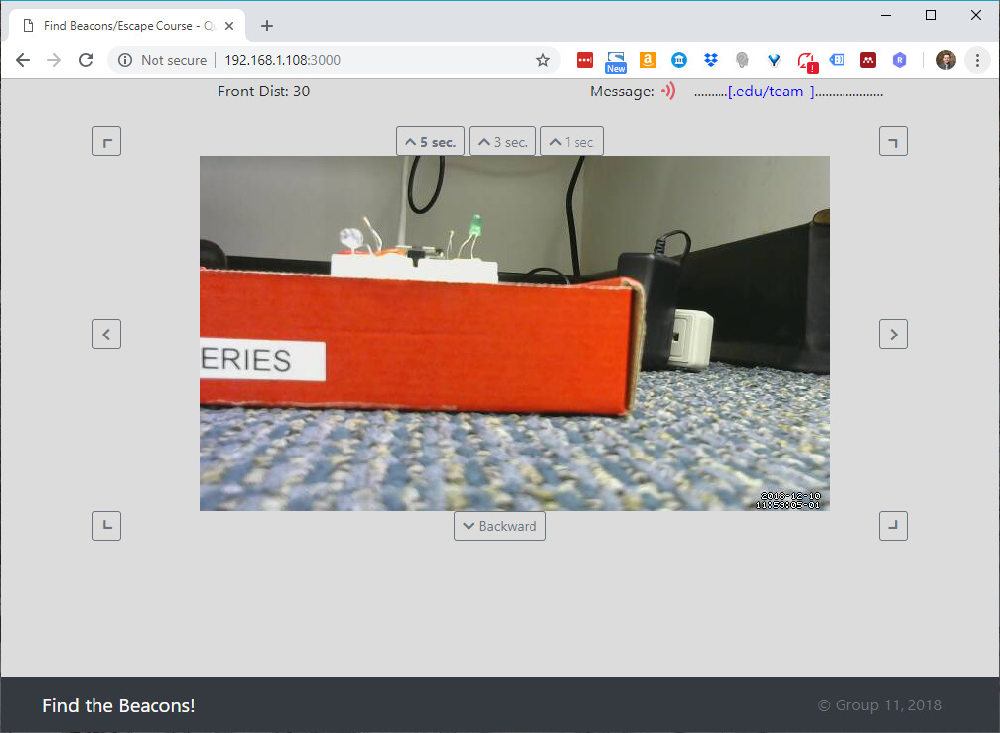

# Escape the Course

Authors: James Coll, Matt Boyd, Alex Trinh

## Summary

We are able to control our car using a web app for directional inputs. It is able to move forwards, backwards, left, right. The car is equipped with an ultrasonic sensor in the front for collision avoidance and a webcam for live video display. Using solely the web app, we
are able to navigate around a course and located IR beacons, concatenating their individual messages together.

## Evaluation Criteria

The following specifcations were required in our solution:
- Car controls and webcam using a web app
- Concatenation of IR messages shown on web app
- DDNS for the web app
- Drive forward, backward, left, and right
- Collision avoidance 

## Solution Design

Our solution modified the car from Quest 4 to satisfy the requirements of the objective. The car has a new state machine consisting of the following states:

  - Idle (no motion)
  - Forward (activate both wheels forward)
  - Backward (activate both wheels backward)
  - Left (activate right wheels only)
  - Right (activate left wheels only)
  - Counting (determines the time spent in each movement)
  
Each of the movement states transitions into the counting state, which determines how long the car will stay in a certain motion. After a certain amount of time has elapsed, the car goes back into its Idle state, waiting for the next desired movement state. The car transitions into these movement states through a POST request from the RPi to the ESP. These requests can be sent using the web app by clicking on the desired directional arrow.

By varying the amount of time in each state, we're able to achieve 3 amounts of turn in both the left and right direction, as well as 3 different lengths of forward motion:

  - Front Left turn "FL": turn 45 degrees left
  - Left turn "L0": turn 90 degrees left
  - Backwards Left turn "BL": turn 135 degrees left
  - Front Right turn "FR": turn 45 degrees right
  - Right turn "R0": turn 90 degrees right
  - Backwards Right turn "BR": turn 135 degrees right
  - Forward 1 "F1": move forward for 0.5 second
  - Forward 2 "F2": move forward for 1 second
  - Forward 3 "F3": move forward for 2 seconds

When an object is detected within 30cm of the front sensor, the car automatically goes into IDLE state. While an object remains within 30cm of the front sensor, forward motions "F2" and "F3" are disabled to prevent the car from colliding with the object. 

To retrieve the fragments of code from each beacon, a GET request is sent from the ESP to the RPi to relay data from the IR receiver. These fragments are then concatenated in accordance to their ID numbers and displayed on the web app in real-time. This request is also used to relay sensor data in real-time for collision avoidance.

## Sketches and Photos

Preliminary Sketches:

Final Sketch:

Carchitecture:

Web App:

## Modules, Tools, Sources Used in Solution

Beacon Code:  
https://github.com/BU-EC444/ec444-repo/blob/master/ir-car-beacon/main/ir-car-beacon.c

Express application generator:  
https://expressjs.com/en/starter/generator.html

Start Bootstrap - The Big Picture Theme:  
https://startbootstrap.com/template-overviews/the-big-picture/

Square brackets with CSS:  
https://stackoverflow.com/questions/13651022/square-brackets-with-css

Socket.Io:  
https://socket.io/get-started/chat

Express 4.x - app.locals:  
http://expressjs.com/en/api.html#app.locals

Express Generator and Socket.io:  
https://github.com/onedesign/express-socketio-tutorial

Get Query Strings and Parameters in Express.js:  
https://stackabuse.com/get-query-strings-and-parameters-in-express-js/

StackOverflow: I can use app.locals directly in templates but not res.locals:  
https://stackoverflow.com/questions/35541270/i-can-use-app-locals-directly-in-templates-but-not-res-locals

Simple CSS Animation Loop – Fading In & Out “Loading” Text:  
https://stackoverflow.com/a/31458204

